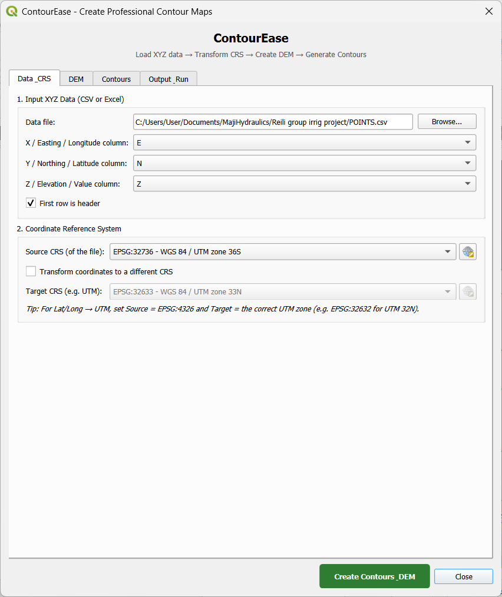
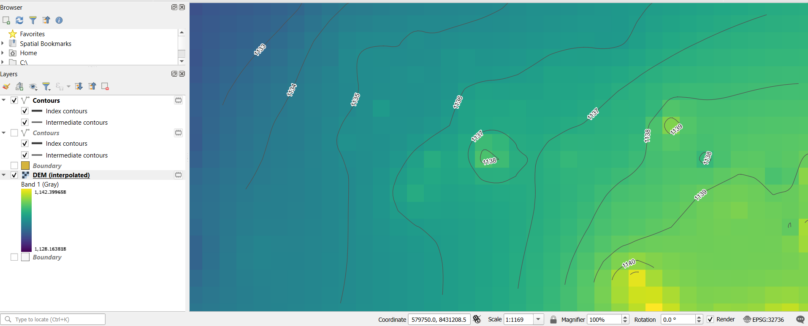

# ContourEase

QGIS plugin to easily create professional contour maps and DEMs from XYZ data (CSV / Excel), with optional boundary clipping and DXF export.

## Screenshots

### Main dialog — data, contours, boundary & DXF options

### Result — contours clipped to boundary and labeled by elevation (Z)

## Features

- Load XYZ data from `.csv`, `.txt`, `.xlsx` or `.xls`
- Select columns for X, Y and Z (auto-detection of common names)
- Coordinate transformation: Lat/Long → UTM or any CRS → any CRS
- DEM creation via IDW or TIN interpolation
- Contour generation with customizable interval
- Contours are **always labeled by elevation (Z)**, never by X or Y
- **Clip / trim contours to a boundary polygon** (shapefile, GPKG, GeoJSON, …)
- Smoothing, index contours, elevation labels with halo
- Attractive DEM color ramps
- **Export selected layers to DXF** (contours, boundary, points — user chooses which)
- Optional save of results to disk (GeoPackage / GeoTIFF)

## Requirements

- QGIS 3.16 or later
- For Excel: `openpyxl` or `pandas` (install via OSGeo4W / pip if needed)

## Installation

1. **Plugins → Manage and Install Plugins → Install from ZIP**
2. Select `ContourEase.zip`
3. Enable the plugin
4. Toolbar button / menu: **Plugins → ContourEase**

## Quick start

1. Open ContourEase
2. **Data & CRS** — choose your XYZ file and columns; set CRS / transform if needed
3. **DEM** — pick IDW or TIN and cell size
4. **Contours** — set interval, enable smoothing / index / labels  
   - Optionally tick **Clip contours to a boundary polygon** and browse to a polygon shapefile (or GPKG / GeoJSON)
5. **Output & Run** — optionally save to folder and/or **Export to DXF** (tick Contours / Boundary / Points).
6. Click **Create Contours & DEM**

## DXF export notes

- Tick the layers you want in the DXF (contours with ELEV attribute, boundary, and/or points)
- Contour elevation is stored in the `ELEV` attribute and is preserved when the DXF driver supports attributes
- If multiple layers are selected and the single-file DXF merge is limited by the driver, additional `*_partN.dxf` files may be written next to the main file

## Author

Hobby Bwanali  
email: hobbybwanali@gmail.com  
https://github.com/hobbybwanali/ContourEase

## License

GNU General Public License v2 (or later). See `LICENSE`.
